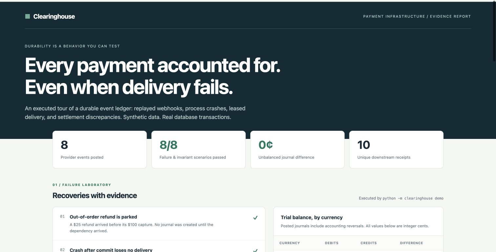

# Clearinghouse

[](https://github.com/bowenzhu21/clearinghouse/actions/workflows/ci.yml)

**Durable payment events, balanced books, and recoverable delivery.**

Clearinghouse is a small backend system for the uncomfortable parts of payment processing: duplicate requests, refunds arriving before captures, crashes between commits and delivery, stale workers, and settlement files that disagree with the event history.

[Explore the operations report](https://bowenzhu21.github.io/clearinghouse/) · [Design & guarantees](docs/DESIGN.md) · [HTTP API](docs/HTTP_API.md)

Built by **Bowen Zhu** with Python and SQLite. All demonstration payments and settlements are synthetic. The system does not move real money or connect to a payment provider.



## What you can inspect

- **Atomic ingestion:** the provider event, balanced journal, idempotency result, and outbox message commit together.
- **Two layers of duplicate protection:** request keys protect retries; provider event IDs prevent a fresh key from posting the same event twice.
- **Database-enforced accounting:** integer cents, one currency per journal, balanced debits/credits, and immutable posted entries.
- **Out-of-order events:** an early refund waits durably for its capture, then posts or receives an explicit rejection.
- **Recoverable delivery:** leased outbox jobs, token fencing, bounded retries, dead-letter handling, and audited replay.
- **Consumer deduplication:** an example downstream inbox suppresses repeated delivery IDs inside its own transaction.
- **Strict reconciliation:** exact, duplicate, missing, amount mismatch, currency mismatch, and unexpected settlements remain distinct.
- **A real HTTP API** plus an offline operations report generated from executed scenarios.

The key guarantee is an atomic local accounting commit with **at-least-once delivery**. The example consumer deduplicates its durable receipt. This is not an end-to-end exactly-once claim for arbitrary external side effects.

## Run the complete demo

Requires Python **3.11+**. There are **no third-party runtime dependencies**, accounts, API keys, or external services.

From an existing checkout, the complete demo runs without installation:

```sh
python3 -m clearinghouse demo
```

For a fresh checkout with an installed CLI and the full test suite:

```sh
git clone https://github.com/bowenzhu21/clearinghouse.git
cd clearinghouse
python3 -m venv .venv
.venv/bin/python -m pip install -e .
.venv/bin/python -m unittest discover -v
.venv/bin/clearinghouse demo --output demo-output --operations 200
```

Open `demo-output/report.html` in a browser. The demo executes **eight scenarios**, produces **nine balanced journals**, and finishes with **ten unique consumer receipts**. It includes a child process that actually exits immediately after committing a capture, before delivering its messages.

Each run preserves its databases under a new `demo-output/run-…/` directory. `demo-output/latest-run.txt` identifies the newest directory. `report.json` contains the executed checks, ledger snapshot, reconciliation results, and locally measured benchmark; `settlement.csv` is the synthetic provider input. Generated artifacts are ignored by Git. The published report is a saved run, not a live payment service.

| Failure drill | What the demo verifies |
|---|---|
| Refund before capture | Pending state survives until its capture arrives |
| Process exits after commit | Posted journals and queued messages remain after restart |
| Duplicate and changed requests | One posting for one event; conflicting reuse is rejected |
| Excessive refund | Committed refunds cannot exceed the capture amount |
| Consumer commits before acknowledgment is lost | Retry produces one durable consumer receipt |
| Repeated delivery failure | Backoff, dead-letter transition, reasoned replay, and recovery |
| Settlement discrepancies | All six reconciliation categories are preserved |
| Accounting correction | Reversal adds an offsetting immutable journal; every currency balances |

## Try the API and worker

Start the server in one terminal:

```sh
.venv/bin/clearinghouse serve --db data/ledger.db --host 127.0.0.1 --port 8080
```

In another terminal, send a synthetic capture:

```sh
curl -sS http://127.0.0.1:8080/v1/events \
  -H 'Content-Type: application/json' \
  -H 'Idempotency-Key: capture-example-1' \
  -d '{"event_id":"evt_example_1","payment_id":"pay_example_1","kind":"payment.captured","amount_cents":10000,"currency":"USD","occurred_at":"2026-01-01T12:00:00Z"}'

curl -sS http://127.0.0.1:8080/v1/payments/pay_example_1
curl -sS http://127.0.0.1:8080/v1/trial-balance

.venv/bin/clearinghouse worker --db data/ledger.db --inbox data/inbox.db --once
```

Repeat the POST with the same key and body: it returns the cached result without another posting. Change the amount while retaining that key: it returns **409**. `worker --once` drains jobs available now; omit `--once` to keep polling. The included worker delivers to the local example inbox, not an external HTTP endpoint.

See the [HTTP guide](docs/HTTP_API.md) for early refunds, authentication, reversal semantics, and error responses.

## Reconciliation and measurement

The CLI accepts this exact CSV header:

```csv
settlement_id,event_id,amount_cents,currency
settlement_1,evt_example_1,10000,USD
```

```sh
.venv/bin/clearinghouse reconcile path/to/settlement.csv \
  --db data/ledger.db --output reconciliation.json

.venv/bin/clearinghouse bench --operations 1000 --output demo-output/benchmark.json
```

Captures are positive and refunds negative in settlement files. Reconciliation compares posted **provider events**; an internal accounting reversal does not change what the provider reported.

The benchmark reports observed p50/p95 ingestion latency, elapsed time, operations per second, Python/SQLite/OS versions, journal count, and balance checks. It measures sequential unique captures on local SQLite WAL with `synchronous=FULL`, including the event, journal, idempotency, and outbox commit. It excludes HTTP, message delivery, network storage, and warmup. Its numbers describe the recorded machine and workload, not production capacity.

## Boundaries that matter

**Provider state and accounting state are separate.** Reversing a journal offsets its book entries. It does not issue a refund, change a provider event, restore refund capacity, or remove an expected provider settlement. An actual refund must arrive as a `payment.refunded` event.

**Idempotency preserves the first response.** If an early refund originally returned `202 pending`, replaying its original key still returns that response after a capture posts it. Read `GET /v1/events/{id}` for current state.

**The storage model is intentionally local.** SQLite serializes writers. There is no distributed consensus, provider webhook-signature verification, external delivery adapter, automated backup/recovery service, or tenant/account authorization model. Pending refunds have no expiry policy. See [the design document](docs/DESIGN.md) for failure windows and extension points.

## Verification and layout

The **35-test suite** exercises real HTTP requests, concurrent ingestion and claims, overspending prevention, real post-commit process termination, rollback before commit, stale-token rejection, final-attempt crashes, consumer deduplication, immutable balanced journals, fractional-cent rejection, malformed JSON/CSV, and reconciliation categories. CI runs Python **3.11 and 3.12**, builds a wheel, and executes its demo outside the source tree to verify packaged SQL resources.

```text
clearinghouse/
  models.py       validated event contract and normalized request hashes
  ledger.py       transactions, journals, outbox leases, example inbox
  schema.sql      accounting constraints and immutability triggers
  api.py          bounded JSON HTTP adapter
  reconcile.py    strict settlement comparison
  demo.py         executed synthetic failure scenarios
  benchmark.py    local commit measurements and environment provenance
  report.py       self-contained operations report
  cli.py          demo, API, worker, reconciliation, replay, benchmark
tests/            accounting, concurrency, HTTP, and reconciliation tests
docs/             design, API reference, published report
```

MIT License · Copyright 2026 Bowen Zhu
