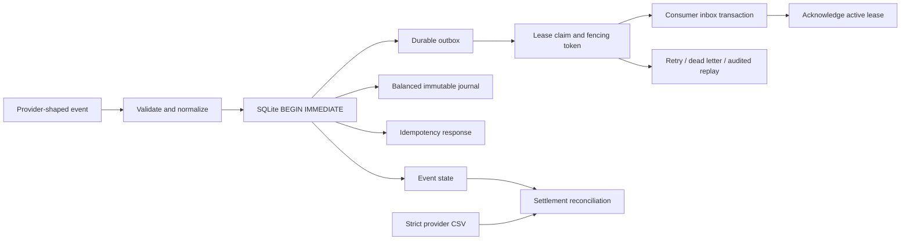

# Design, guarantees, and failure windows

Clearinghouse separates provider event history, accounting entries, message delivery, and downstream consumption. Each has a durable identity and a clear transaction boundary. The demo uses synthetic data and two local SQLite databases; it does not integrate with a real payment network.

## System shape

## Ingestion and identity

The wire contract uses positive integer cents and a small supported currency set. It rejects booleans, floating-point money, unknown fields, invalid identifiers, duplicate JSON keys, and timestamps without a timezone. Times are normalized to UTC with microsecond precision before hashing, so equivalent timezone representations have the same semantic identity.

Two independent keys serve different purposes:

| Identity | Purpose | Changed content |
|---|---|---|
| `Idempotency-Key` | Reproduce the result of a particular operation | Conflict; the original result is retained |
| `event_id` | Identify one provider event across different request keys | Conflict; it cannot be posted under a new meaning |

The request fingerprint includes the operation, preventing a reversal from reusing an ingestion key. A repeated event under a new key returns that event's current result and records it for the new key. A repeat under the original key returns its original cached response.

All state checks and writes run inside `BEGIN IMMEDIATE`. SQLite admits one writer, so a second process cannot observe a partially completed accounting decision or race past a duplicate/amount check. An exception rolls back event state, journal lines, outbox rows, and the idempotency result together. Connections enable foreign keys and `synchronous=FULL`; the database uses WAL.

## Accounting invariants

The project models two accounts, `processor_receivable` and `merchant_payable`, separately for each currency:

| Provider event | Debit | Credit |
|---|---|---|
| Capture | Processor receivable | Merchant payable |
| Refund | Merchant payable | Processor receivable |

The database enforces integer money, nonnegative amounts on a line, exactly one nonzero side per line, valid account codes, and one currency within each balanced journal. Line inserts precede the header under a deferred foreign key. The header trigger checks at least two lines and a zero debit-minus-credit sum. Once the header exists, triggers forbid appending, editing, or deleting its lines or altering its header. An unsealed group of lines cannot commit because its foreign key would remain unresolved.

The application and unique index allow only one posted capture per payment. Refunds must use that capture's currency and the sum of posted refunds must not exceed its amount. The check and posting share the writer transaction, including under concurrent requests.

`trial_balance()` reports debit, credit, and debit-minus-credit totals by currency/account. A negative merchant-payable balance reflects the credit side of this model; it is not a customer's spendable balance.

## Events arriving out of order

A refund without a posted capture is saved as `pending`, with no journal. A later capture reconsiders that payment's pending refunds inside its transaction, ordered by normalized `occurred_at` and `event_id`. Each refund then posts or is durably rejected. An invalid pending refund does not prevent a valid capture from posting.

This ordering is deterministic for the pending set visible to that transaction. It is not a guarantee that the service retroactively reorders all events by provider time. Concurrent arrivals are still serialized by their commits.

The initial pending response remains cached under its request key. Poll the event resource for its current state. A refund whose capture never arrives remains pending indefinitely; a retention/escalation policy is outside this version.

## Reversal is an accounting operation

Reversal appends a new journal containing the original lines with debit and credit swapped. It retains the original posting, requires a nonblank reason, records the original journal ID, and emits an outbox event. An original journal can be reversed once; a reversal cannot itself be reversed. Repeating the same reversal request/key returns its original result.

It does **not** contact a provider, issue a refund, alter provider event history, or reset refund capacity. Consequently, `payment().net_cents` and expected provider settlements can differ from the accounting position after an internal correction. They intentionally describe different sources of truth. Record an actual provider refund using `payment.refunded`.

## Delivery protocol

A claim transaction selects one currently eligible job and assigns a new random token and expiry. Every claim increments attempts. Acknowledgment and failure updates require that exact token and a lease whose expiry is strictly later than the supplied/current time. A stale worker therefore cannot acknowledge a job reclaimed by another worker, including at the exact expiry boundary.

Failures schedule exponential delays of `min(60, 2**attempts)` seconds. The normal worker uses a 30-second lease and five attempts. A worker dying on its final attempt does not strand the job: a later claim scan moves it to the dead-letter queue after expiry. Replay requires an operator-supplied reason, adds an audit row, clears the dead-letter state, and resets its attempt count.

All workers for a queue must use the same lease/attempt policy. This version accepts policy arguments in the library rather than storing a versioned retry policy on each job. Lease comparisons assume a common local wall clock; there is no distributed clock protocol or lease-renewal service.

## Crash windows and delivery semantics

| Interruption | Durable state | Recovery |
|---|---|---|
| Before the ingestion commit | No partial operation is committed | Retry with the same key |
| After commit, before message claim | Journal and outbox message both exist | A worker claims the message |
| After claim, before consumer commit | The message remains unacknowledged | Reclaim after lease expiry |
| After consumer commit, before acknowledgment | Consumer receipt exists; producer can retry | Consumer deduplicates the stable job ID |
| Final attempt ends without acknowledgment | Expired lease with exhausted attempts | Claim scan marks dead letter |

Delivery is **at least once**. The included consumer makes its receipt insertion and delivery-ID deduplication one transaction. For a real business effect, that effect must be committed inside the same consumer transaction or protected by the destination's own idempotency mechanism. An arbitrary HTTP side effect followed by a local receipt insert would reopen the duplicate-effect window.

The post-producer-commit crash drill terminates a real child process with `os._exit(23)`. The consumer-commit/acknowledgment-loss drill deliberately omits acknowledgment and advances the controlled clock; it simulates that protocol window rather than killing a second process. Other drills inject failures explicitly. The report distinguishes scenario evidence from production traffic.

## Reconciliation

The parser requires the exact column order `settlement_id,event_id,amount_cents,currency`, strict CSV quoting, safe identifiers, supported currency codes, and signed integer cents. Expected rows come from posted provider events: captures positive, refunds negative.

Classification precedence is missing → duplicate → unexpected → currency mismatch → amount mismatch → exact. A repeated event ID or a settlement ID reused anywhere in the file is classified as a duplicate, even if one row happens to match. Nothing chooses an arbitrary winning row. Reconciliation produces a report and does not rewrite the ledger.

## Scope and operational limits

- Single local SQLite database with serialized writers; no distributed consensus, sharding, failover, or network-filesystem guarantee.
- The HTTP adapter uses the standard library server. It is suitable for local demonstration; a production deployment needs an appropriate server/proxy, TLS, rate limits, request observability, and an operational plan.
- An optional bearer token protects the adapter; non-loopback binds require it. There is no provider-specific webhook signature verification, key rotation workflow, tenant model, or per-operation authorization.
- The worker uses a separate local consumer inbox. No external HTTP consumer, payment rail, or processor connector is implemented.
- No idempotency expiry, automatic pending-refund expiry, backup tooling, storage quotas, or schema-migration framework beyond version checking.
- Integer cents fit this supported currency set. There is no foreign exchange, arbitrary minor-unit currency support, fees, disputes, authorization/capture lifecycle, or real settlement execution.
- Benchmarks are sequential local commit observations. They exclude HTTP and delivery, and do not establish concurrent service capacity or a latency SLA.
- Repeated demo runs preserve the same scenario assertions, while journal IDs, run IDs, timestamps, and timings change. This is reproducible behavior, not byte-identical output.

The deliberate extension points are provider validation, the delivery adapter, the consumer transaction, and an expanded accounting/event model. Those additions should preserve the existing transaction and identity boundaries rather than weakening them for convenience.
